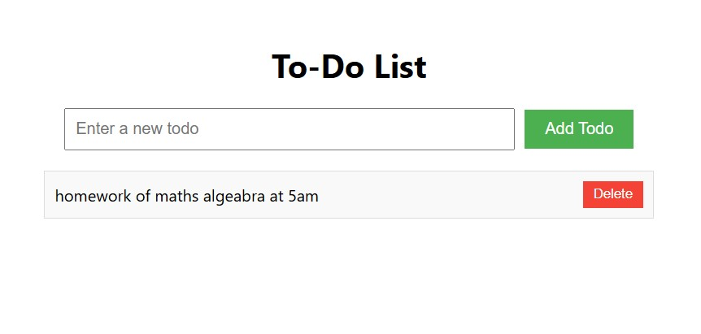

<div align="center">
  
# 📋 React To-Do List App



### A Modern, Clean & Efficient To-Do List Application

*Built with React • Powered by Vite • Perfect for College Assignment*

---

</div>

A simple and clean to-do list application built with React for college assignment.

## ✨ Features

✅ **Add Todo Items** - Add new tasks using the input field and button  
✅ **Display List** - View all your todo items in an organized list  
✅ **Delete Items** - Remove completed or unwanted tasks with a click  
✅ **Unique IDs** - Each todo has a unique identifier for proper list management  

## Tech Stack

- **React** 18.2 (Functional Components)
- **Vite** (Fast build tool)
- **CSS** (Basic styling, no frameworks)

## Project Structure

```
react-todo-app/
├── src/
│   ├── App.jsx           # Main component with state management
│   ├── TodoInput.jsx     # Input form component
│   ├── TodoList.jsx      # List container component
│   ├── TodoItem.jsx      # Individual todo item component
│   ├── index.css         # Styling
│   └── main.jsx          # React DOM entry point
├── index.html            # HTML entry point
├── package.json          # Dependencies
├── vite.config.js        # Vite configuration
└── assets/               # Image assets
```

## Getting Started

### Prerequisites
- Node.js installed

### Installation

```bash
# Navigate to project folder
cd react-todo-app

# Install dependencies
npm install

# Start development server
npm run dev
```

The app will run at `http://localhost:5173/`

## Key Concepts Demonstrated

- **useState Hook** - State management for todos list
- **Props** - Data passing between parent and child components
- **List Keys** - Proper React list rendering with unique keys
- **Event Handling** - Form submission and click events
- **Functional Components** - Modern React pattern

## How to Use

1. **Add a Todo** - Type in the input field and click "Add Todo"
2. **View Todos** - All items appear in the list below
3. **Delete a Todo** - Click the "Delete" button next to any item

---

**Author:** [@princejha-dev](https://github.com/princejha-dev)
**Created:** April 2026  
**Status:** ✨ Complete and Working
